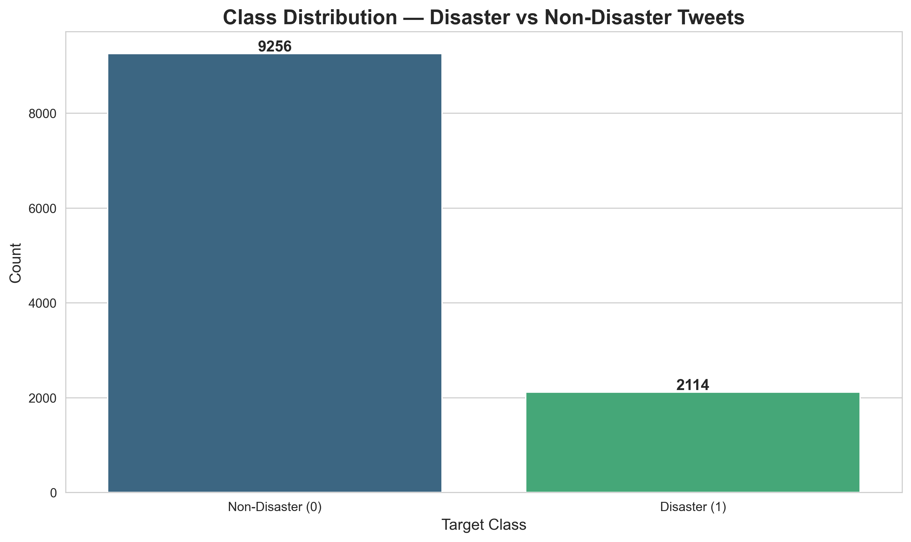
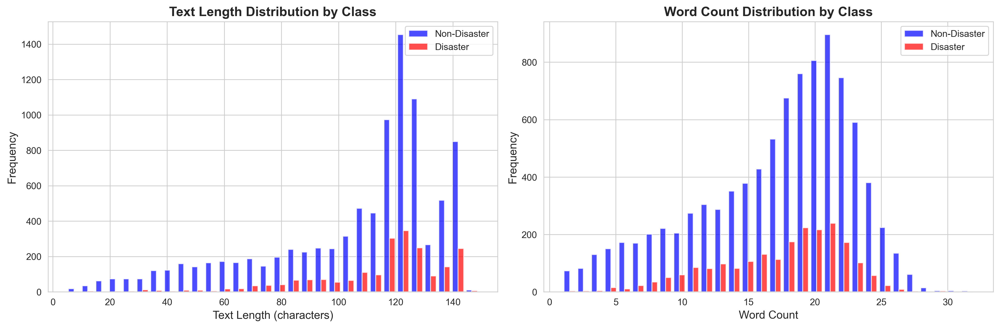
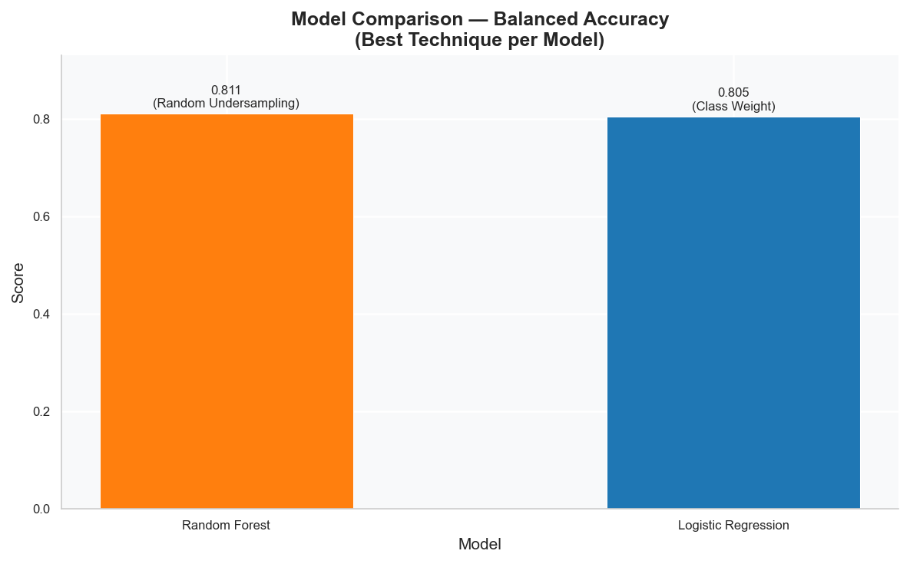
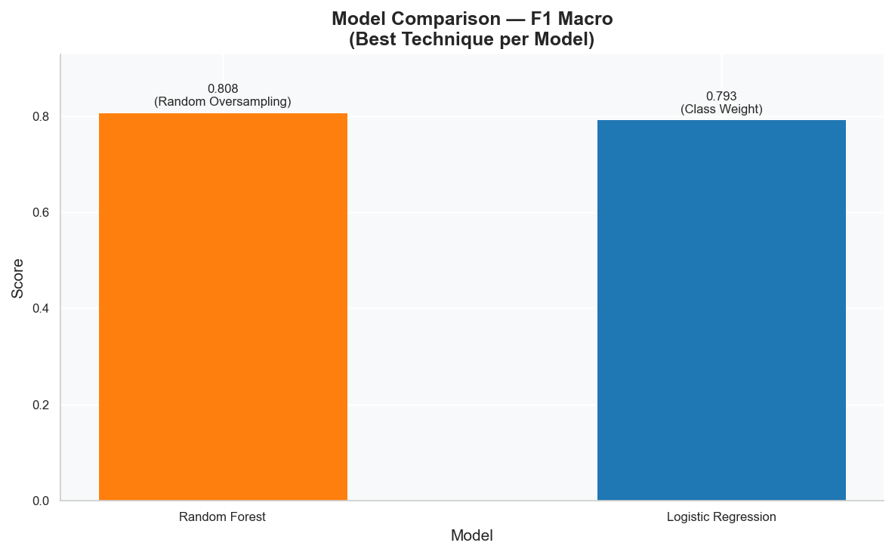
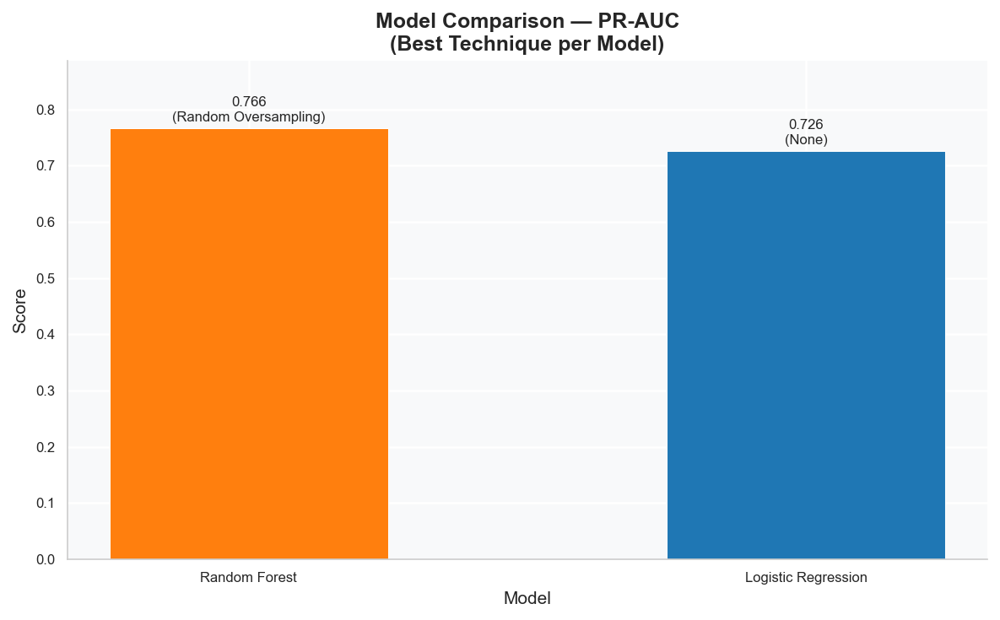
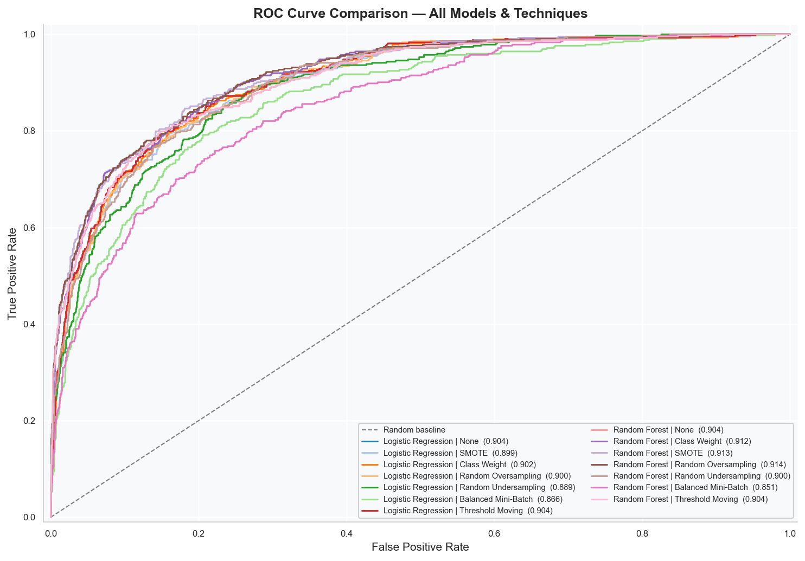
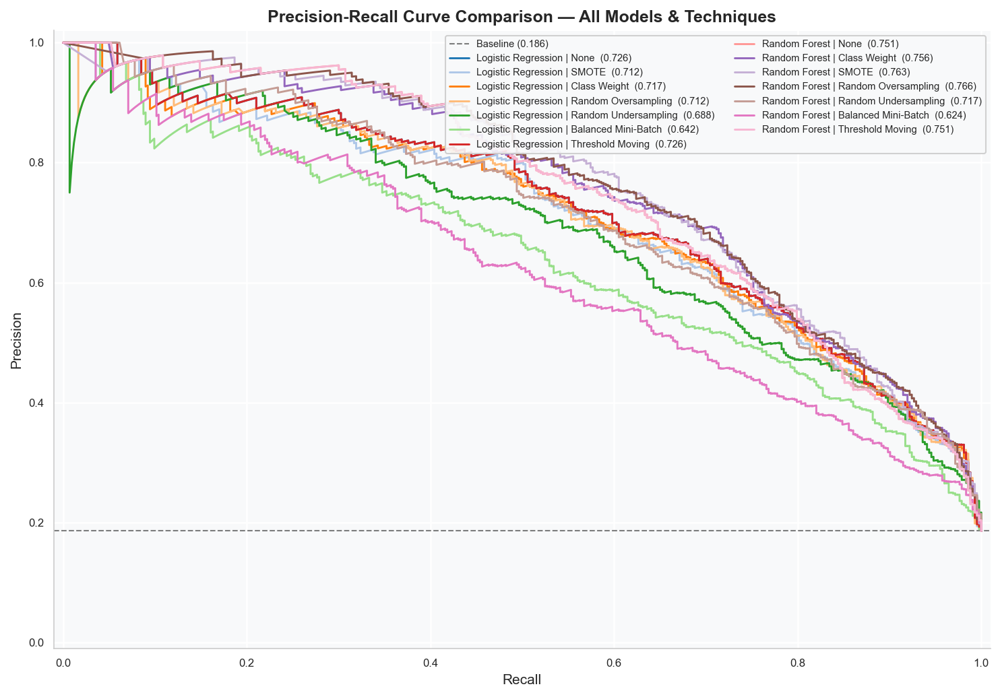
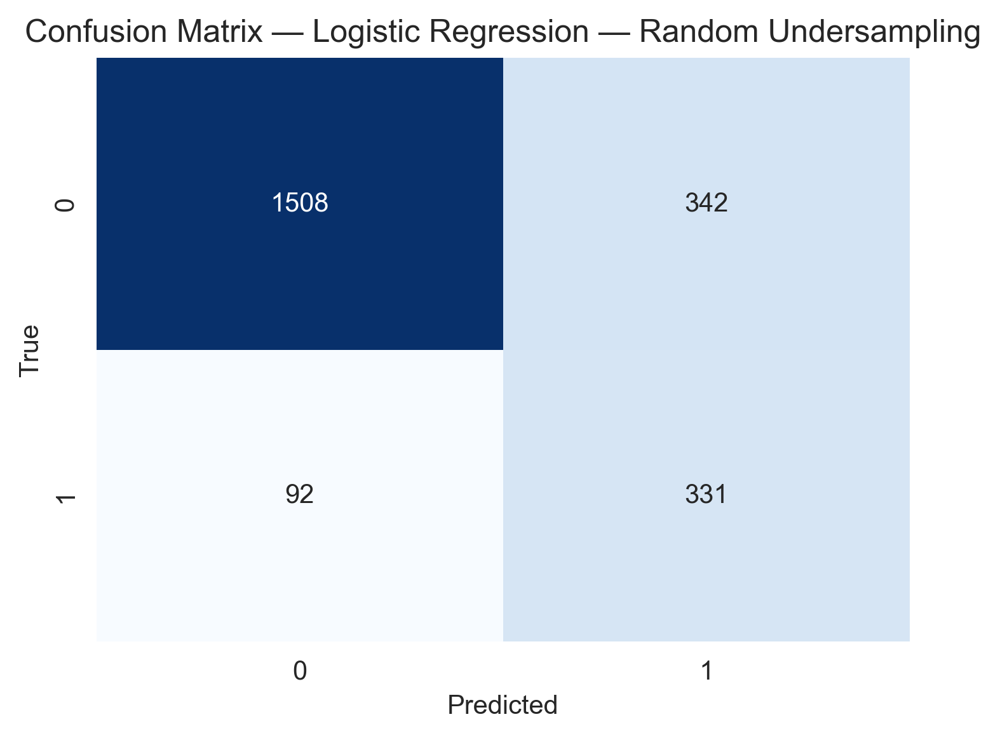
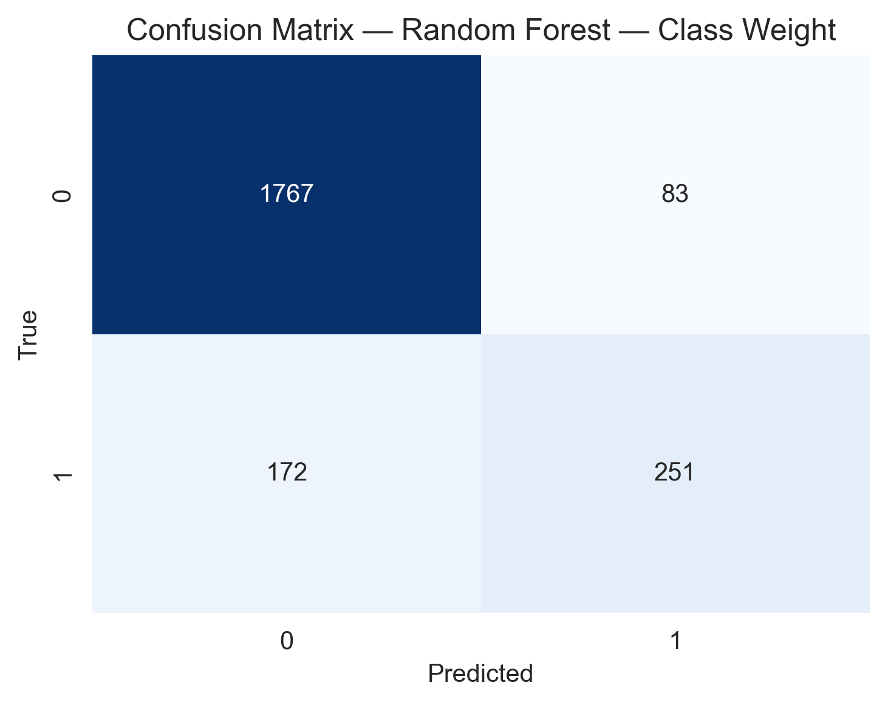
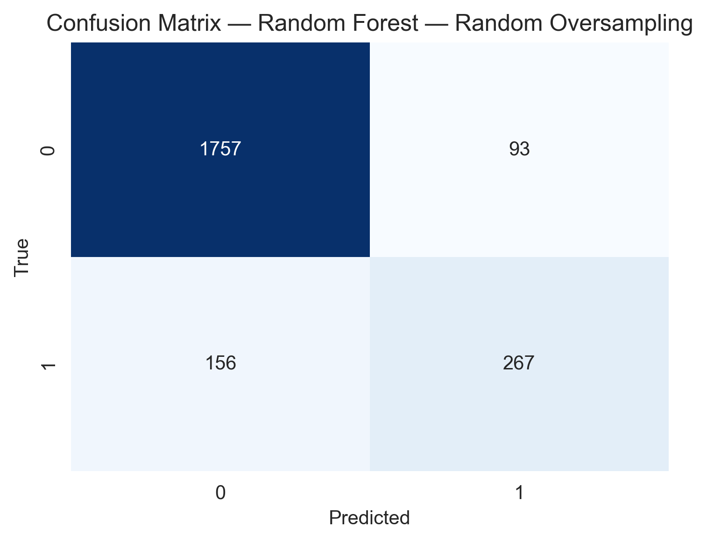

# CS3012E Artificial Intelligence
## Final Course Project Report: Imbalanced Disaster Tweet Classification

Department of Computer Science and Engineering  
National Institute of Technology Calicut

Team Members:
1. Atluri Venkata Sai Vignesh Chowdary
Roll Number: B230857CS
2. Adimulam Yaswanth Veera Nagesh
Roll Number: B230755CS
3. Munukuntla Rithvik Reddy
Roll Number: B231114CS
4. Teja Chinthala
Roll Number: B230267CS
5. Kukkala Sai Dinesh Reddy
Roll Number: B231035CS

---

## 1. Introduction

This project addresses the task of binary tweet classification, where each tweet must be identified as either disaster-related or non-disaster. The practical motivation is that emergency situations generate a large and noisy social media stream, and manual filtering is both slow and error-prone. A robust automated classifier can support faster triage by surfacing relevant posts for further human verification.

The central technical challenge is class imbalance. In this dataset, non-disaster tweets significantly outnumber disaster tweets, so a model can appear strong if evaluated only by accuracy while still failing on the class that matters most in operational settings. For this reason, the project is designed around class-aware evaluation and comparative experimentation.

The work follows assignment requirements by implementing three model families, namely Logistic Regression, Random Forest, and a Neural Network with the required fixed architecture pattern. The experiments are performed in two parts: first without imbalance treatment to establish baselines, and then with multiple balancing strategies to measure tradeoffs in minority-class behavior. The final goal is not only to present best scores, but to provide a clear interpretation of why specific metrics improve or decline under each method.

---

## 2. Dataset Description

The dataset used in this project is the Kaggle Disaster Tweets dataset, loaded from data/train.csv. The target variable is binary, with label 0 representing non-disaster tweets and label 1 representing disaster tweets. After loading and validation, the dataset contains 11,370 total samples.

Class distribution analysis shows 9,256 samples in class 0 and 2,114 samples in class 1, corresponding to 81.41% and 18.59% respectively. This yields an approximate majority-to-minority ratio of 4.38:1, which confirms a substantial imbalance and justifies the use of macro and class-wise metrics in addition to overall accuracy.

The missing value profile indicates no missing values in keyword and text after project-level handling assumptions used in the pipeline, while the location field has 3,419 missing entries. Since the primary predictive signal is extracted from tweet text, these missing location entries do not block training but are acknowledged as part of the dataset’s real-world noise characteristics.

---

## 3. Preprocessing and Feature Engineering

The preprocessing pipeline is intentionally designed for social media text, where abbreviations, hyperlinks, tags, and informal grammar are common. Processing begins with normalization by converting text to lowercase and removing URLs, mentions, and HTML entities. Hashtag words are preserved by removing only the hash symbol so that informative terms remain available for downstream vectorization.

To protect semantic cues that are important for disaster detection, contraction expansion is applied before token filtering so that negation terms are not lost. Tokenization is performed with TweetTokenizer, which is more robust to punctuation and short forms than generic tokenizers in this domain.

After tokenization, very short tokens and standard stopwords are removed, but negation words such as no, nor, not, and never are explicitly retained. This design choice is essential because phrases containing negation can reverse meaning in critical contexts. Lemmatization is then applied to reduce inflectional variants and increase vocabulary consistency.

Feature engineering is done through TF-IDF vectorization with max_features set to 5000, ngram_range set to (1, 2), and min_df set to 2. This configuration captures both individual words and important short phrases while controlling dimensionality and noise. The final dataset split is stratified with test_size = 0.2 to preserve class proportions between train and test partitions.

---

## 4. Methodology

Three model families are trained and tuned under a unified experimental protocol. Hyperparameter selection is guided by macro-sensitive objectives so that minority-class behavior is not ignored during model selection.

For Logistic Regression, tuning includes regularization strength with C values in {0.01, 0.1, 1, 10}, solver selection among liblinear and lbfgs, and threshold adjustment on validation probabilities. Model selection is performed with 5-fold stratified cross-validation using F1 macro as the optimization objective.

For Random Forest, the grid includes n_estimators in {100, 200, 300}, max_depth in {10, 20, None}, min_samples_split in {2, 5}, and min_samples_leaf in {1, 2}. A threshold optimization stage is also included to improve class-wise tradeoff control. GridSearchCV is applied with F1 macro scoring to align with imbalance-aware evaluation priorities.

For the Neural Network, the fixed assignment-constrained architecture is followed as Dense 64 to Dense 32 to Dense 16 to sigmoid output. The search spans activation functions (relu, leakyrelu, tanh, elu), learning rates (0.001, 0.0005), optimizers (adam, rmsprop, sgd), batch sizes (32, 64), epochs (15, 25), dropout rates (0.2, 0.3), L2 regularization strengths (0.001, 0.01), and initializers (glorot_uniform, he_normal). Because the full cartesian space is large, a randomized subset of 18 candidate combinations is evaluated, followed by threshold tuning on validation probabilities.

Part B applies six imbalance-handling techniques across model families: class weighting, SMOTE, random oversampling, random undersampling, balanced mini-batch ensemble strategy, and threshold moving. This combination intentionally includes both data-level and decision-level methods so that performance can be compared from complementary perspectives.

---

## 5. Experimental Setup

The project is implemented in Python with dependencies specified in requirements.txt. Core packages include pandas, numpy, scikit-learn, nltk, imbalanced-learn, matplotlib, seaborn, and tensorflow/keras for neural components. The pipeline is designed to remain functional in environments where TensorFlow may be optional, allowing classical model experimentation even when neural dependencies are unavailable.

Execution is performed through python src/run_experiments.py, which orchestrates data loading, preprocessing, vectorization, splitting, tuning, baseline runs, imbalance-method runs, and artifact export. The pipeline also writes output files needed for reporting, including cleaned data, model comparison tables, confusion matrices, ROC curves, PR curves, and summary visualizations.

Each model-technique result row includes Accuracy, Balanced_Accuracy, Precision_class_0, Precision_class_1, Recall_class_0, Recall_class_1, Precision, Recall, F1_macro, F1_weighted, ROC_AUC, and PR_AUC. This metric set is intentionally broad so that tradeoffs can be interpreted beyond single-score ranking.

---

## 6. Results

Primary quantitative results are taken from outputs/results/model_comparison_results.csv. Across all evaluated rows, the highest Accuracy is achieved by Random Forest with SMOTE at 0.8869. The highest Balanced_Accuracy is achieved by Logistic Regression with Random Undersampling at 0.8064. The highest F1_macro is achieved by Random Forest with Class Weight at 0.7998, while the highest F1_weighted is also obtained by Random Forest with Class Weight at 0.8823. The highest ROC_AUC is 0.9124 for Random Forest with Class Weight, and the highest PR_AUC is 0.7521 for Random Forest with Random Oversampling. The strongest class-1 recall appears in Logistic Regression with Random Undersampling at 0.7896, while the strongest class-1 precision is observed in baseline Random Forest at 0.7903.

The baseline comparison without imbalance handling shows that Logistic Regression achieves Accuracy 0.8812 with Balanced_Accuracy 0.7520, Precision_class_1 0.7476, Recall_class_1 0.5461, F1_macro 0.7802, ROC_AUC 0.8986, and PR_AUC 0.7172. Random Forest baseline records Accuracy 0.8821 with Balanced_Accuracy 0.7343, Precision_class_1 0.7903, Recall_class_1 0.4988, F1_macro 0.7710, ROC_AUC 0.8989, and PR_AUC 0.7363. Neural Network baseline reaches Accuracy 0.8759 with Balanced_Accuracy 0.7423, Precision_class_1 0.7296, Recall_class_1 0.5296, F1_macro 0.7699, ROC_AUC 0.8949, and PR_AUC 0.7088.

Model-wise behavior under balancing confirms expected shifts. Logistic Regression shows a large gain in class-1 recall from 0.5461 to 0.7896 under random undersampling, while class-1 precision decreases from 0.7476 to 0.5053, yielding a more recall-focused operating point and improved balanced accuracy. Random Forest remains the most stable high performer across global ranking metrics, with class weighting producing the strongest combined macro and ROC behavior, and random oversampling producing the strongest PR behavior. Neural Network variants display meaningful recall improvement under balancing but generally accept a precision penalty on class 1.

All values reported in this section are consistent with the generated results table and with qualitative trends visible in confusion matrices and ROC/PR plots.

---

## 7. Essential Plots and Visual Interpretation

The following figures provide the minimum visual evidence required to support the quantitative claims in this report. The class distribution plot confirms the underlying imbalance that motivates the entire design of the study, while the text and word-length distribution plot shows that both classes occupy similar textual length ranges and therefore class imbalance cannot be attributed to trivial length differences alone.

The cross-model summary plots make the tradeoff structure explicit. Balanced accuracy and macro F1 are most suitable for this assignment because both metrics emphasize minority-class behavior, and the PR-AUC comparison is especially important because the positive class is the operational target under imbalance.

The all-model ROC and PR comparison figures provide a full threshold-independent view. The ROC comparison shows separability trends across all model-technique combinations, and the PR comparison shows positive-class ranking quality where differences are more informative under class imbalance.

Confusion matrices are included for the three most decision-relevant operating points in this project. Logistic Regression with random undersampling demonstrates the strongest minority recall profile, Random Forest with class weighting captures the best macro-balanced operating point, and Random Forest with random oversampling shows the strongest PR-oriented minority detection behavior in this run.

For completeness of neural model behavior, the training curve is included to show stable convergence with a persistent train-validation gap that matches the moderate generalization pattern observed in downstream metrics.

---

## 8. Analysis and Discussion

The observed metric shifts are technically consistent with imbalanced classification theory. As balancing interventions become stronger, model decision boundaries move toward identifying more minority instances. This usually improves recall for class 1 but also increases false positives, which lowers precision for class 1. Therefore, a decline in Precision_class_1 accompanied by a gain in Recall_class_1 is not a model failure; it is the expected consequence of changing error priorities.

Accuracy can decrease in this setting because majority-class mistakes become more frequent when the classifier is made less conservative. Balanced_Accuracy, however, often improves because it averages recall across classes rather than being dominated by the larger class. This behavior is evident in the reported experiments and supports the use of class-aware metrics for decision-making.

F1_macro offers a useful compromise by rewarding balanced quality across classes, while F1_weighted remains influenced by class frequency and therefore can remain high even when minority recall is modest. ROC_AUC reflects ranking quality over thresholds and indicates how separable the classes are independent of a single operating point. PR_AUC is especially informative here because it emphasizes precision-recall behavior for the positive class under imbalance.

A notable outcome is that some baseline settings remain competitive against specific imbalance variants, especially for Neural Network and Random Forest in precision-sensitive views. This is a valid and common outcome. Imbalance handling is not guaranteed to improve every metric simultaneously; instead, it shifts the operating tradeoff, and the preferred model should be selected according to application priority.

For disaster response scenarios where missing true disaster tweets is costly, recall-focused configurations such as Logistic Regression with Random Undersampling are justifiable. For stronger all-round discrimination and stable global performance, Random Forest with Class Weight provides a better balanced option. For precision-recall ranking quality in minority detection, Random Forest with Random Oversampling is the strongest choice in this run.

---

## 9. Conclusion

This project successfully delivers an end-to-end disaster tweet classification pipeline that satisfies assignment requirements for model diversity, imbalance comparison, and interpretable evaluation. The implementation demonstrates that classical and neural approaches can all produce strong baseline accuracy, but imbalance-aware analysis is essential to avoid misleading conclusions.

The experiments show that no single configuration dominates all objectives. Instead, each balancing method changes the precision-recall operating point in predictable ways. The final recommendation depends on deployment priority. If the objective is maximizing disaster detection sensitivity, Logistic Regression with Random Undersampling is the most suitable choice. If the objective is robust overall balance across metrics, Random Forest with Class Weight is preferred. If the objective is strongest precision-recall ranking behavior for minority detection, Random Forest with Random Oversampling is recommended.

Before submission, the team member identity line should be replaced with actual names, roll numbers, and email addresses. The result CSV and plot artifacts should be verified as the final run outputs, and this report should be exported to PDF and submitted together with source code, notebook, and dependency specification.

